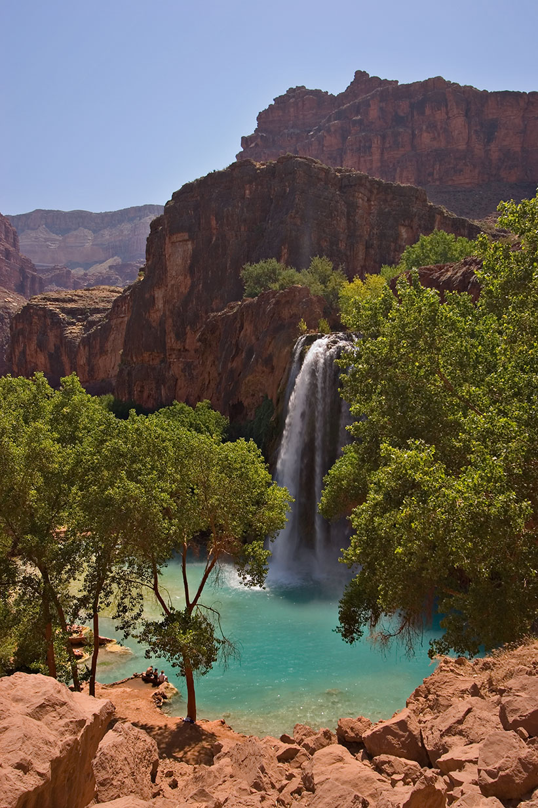
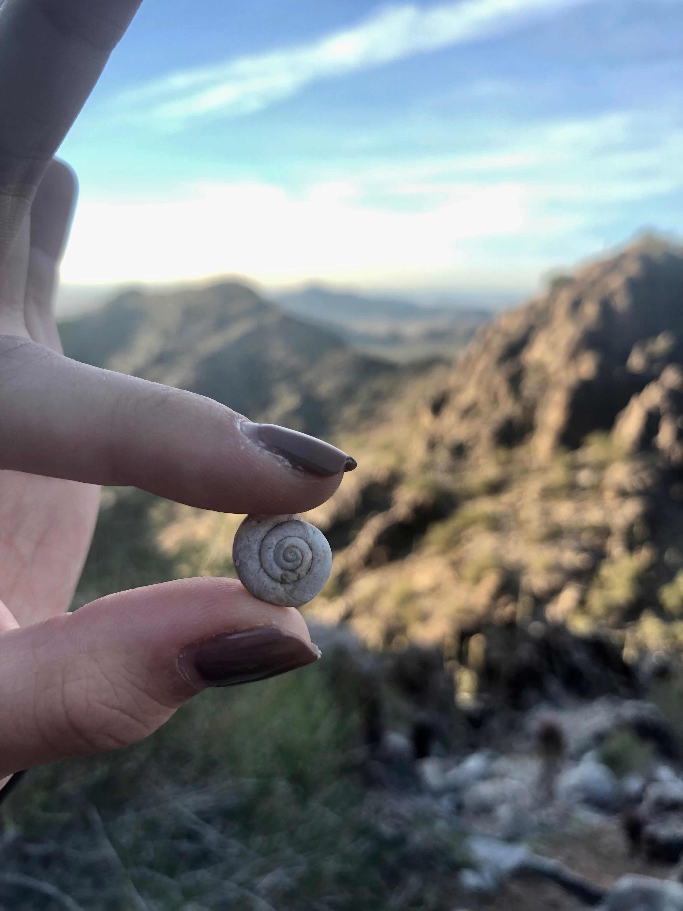
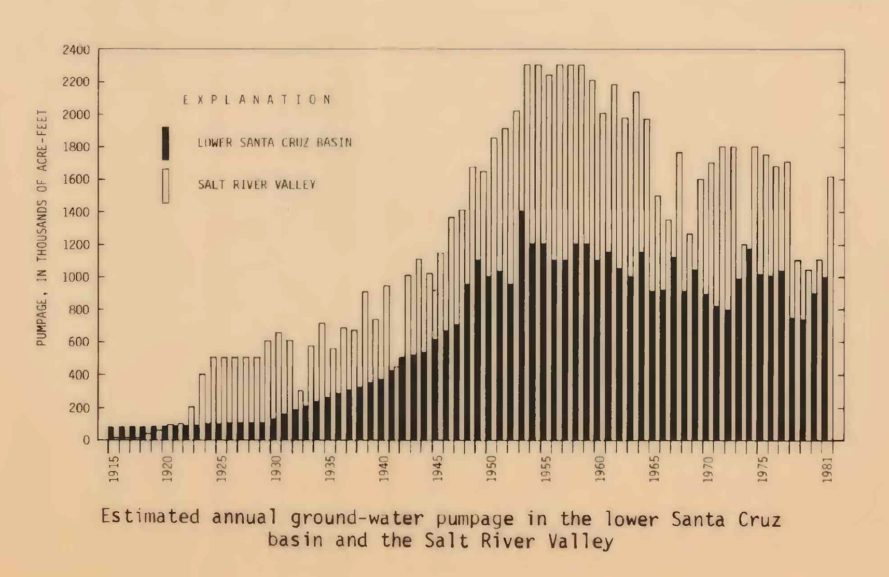

###### {A topographic map of Phoenix, 1914, showing the Salt River, the Gila River, and multiple canals}

###### {Havasupai Falls}

(User:Moondigger, CC BY-SA 2.5 <https://creativecommons.org/licenses/by-sa/2.5>, via Wikimedia Commons)

The Havasupai people of Northern Arizona are well-known around the world as a result of one waterfall that is located on their land: Havasupai Falls. This waterfall is also within the bounds of Grand Canyon National Park. People travel from thousands of miles away, with months or years of planning in advance in order to get a photo-op with the brilliantly turquoise blue waters of Havasupai Falls. The draws of the falls for tourists brings attention to one aspect of the cultural significance of the water but misses a central point. 

I listened to an episode titled “Resiliency” of a podcast called “Podship Earth” in which Jared Blumenfeld, the California Secretary for Environmental Protection, interviews Rochelle Tilousi, a Havasupai woman. Jared asks about the meaning of the water to her and her tribe, and in response she shares that “in one of the creation stories, the Havasupai people came to be through a drop of spring water and the sunshine coming into the woman who gave birth to the Havasupai people…the water is very sacred to our tribe.” Verbally acknowledging that the water is sacred to the Havasupai people is perhaps the most justice words can do to illustrate the importance of this water to the Havasupai. However, I would like to pause on this example to set the stage for a continuous theme throughout this essay. There is one side of Nixon’s idea of slow violence (Nixon, 2011) that white settlers have inflicted upon Native Americans in which natural resources have been gradually diverted away, leading to agricultural decline on reservations (see Chapter 4). However, one could coin “spiritual violence” as another form of slow violence that has been harmful to Native Americans. From a capitalistic viewpoint, one only needs as much water as one requires, thus, the rest must be profited off of one way or another, whether through tourism or exportation. Introducing these elements also introduces potentially hazardous environmental impacts, like in the case of the Havasupai, things as simple as an abundance of litter, to larger threats like the quality of the water and if it is be safe for the Havasupai children to swim in. Though those are valid concerns, they need not be required in order to bring attention to the importance of preserving land and resources. Many environmental perspectives lack sufficient protections for the sacrality of natural resources that many Native Americans hold. When a resource is designated as religious artifact, that ought to be sufficient motivation for protecting the resource. 

### The Desert Wasn't Always a Desert

Next, a paradigm shift about the desert and its relationship with water, told by a story occurring over millions of years. Arizona, yes Arizona, or at least significant parts of it, was probably buried underneath the sea many millions of years ago during the Paleozoic Era (National Park Sevice). Now, the closest thing Arizona has to an ocean requires a six-hour drive west to California, or four-hour drive south to Puerto Peñasco, Mexico. (That is, with one small exception. The Biosphere are the University of Arizona in Tucson includes a simulated ocean (Lee, 2014). With climate change hard at work, it is predicted that Arizona will become a coastal state in one thousand years (Stern, 2015) after sea-levels increase by 30 meters and swells the Colorado River Delta (Stern, 2015). Though visions of an Arizonan beach might sound enticing, Stern points out that “lying on the beach might not be fun if it's 130 degrees,” given the correlation of rising sea-levels and rising temperatures.

###### {A shell found in the desert near Scottsdale, Arizona. Traces of Arizona’s oceanic past still remain. Or maybe this was a coincidence ¯\(ツ)/¯}

What the layman might not know about Phoenix in its present state is that a huge quantity of water is stored underground beneath Phoenix. Phoenix's nickname is the "Valley of the Sun" but, ironically, the fact that it is a valley makes it a great place for a different element: water. 

Thomsen & Baldys remind us that rain is scarce in Phoenix, whereas evaporation happens at incredible rates under the desert sun.

<blockquote>
    “...average annual precipitation is about 8 in., and the average annual lake precipitation is about 75 in… irrigated agriculture, which became a prominent industry in the 1940’s, uses most of the available surface water and between 1 and 2 million acre-feet of ground water each year" (Thomsen & Baldys, 1985).
</blockquote>

Furthermore, the ground water that might be hidden from Phoenicians' consciouses is anything but idle or unutilized. As cited, the amount of ground water that was extracted for agricultural use almost 50 years ago was great in magnitude.

###### {Graph in Thomsen & Baldys' USGS report illustrating ground-water pumpage in the Phoenix area from 1915-1981} 

### References

Thomsen, B. W., and Stanley Baldys. Ground-water conditions in and near the Gila River Indian Reservation, south-central Arizona. No. 85-4073. 1985.

Nixon, Rob. Slow Violence and the Environmentalism of the Poor. Harvard University Press, 2011.

Geologic Evolution of the Parashant: Grand Canyon-Parashant National Monument Arizona. National Park Service. Retrieved from https://www.nps.gov/para/learn/nature/geologic-evolution-of-the-parashant.htm. 

Lee, J. L. Why Are Scientists Building an "Ocean" in the Middle of a Desert? National Geographic. Retrieved from https://www.nationalgeographic.com/science/article/140718-biosphere-gulf-california-environment-ocean-science. 

Stern, Ray. Climate Change to Transform Arizona Into Coastal State. Phoenix New Times. Retrieved from https://www.phoenixnewtimes.com/news/climate-change-to-transform-arizona-into-coastal-state-7798437. 

