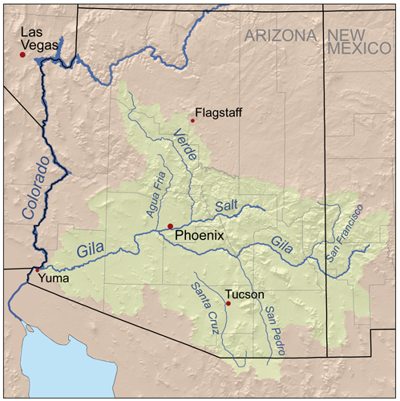
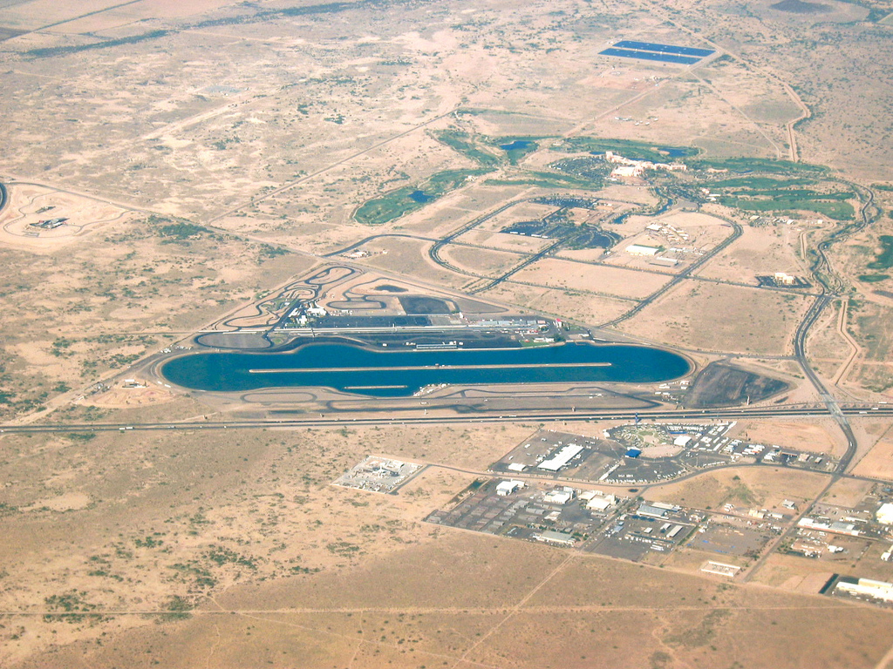
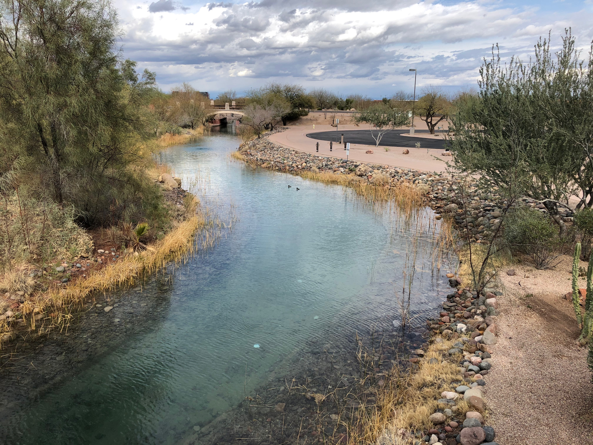
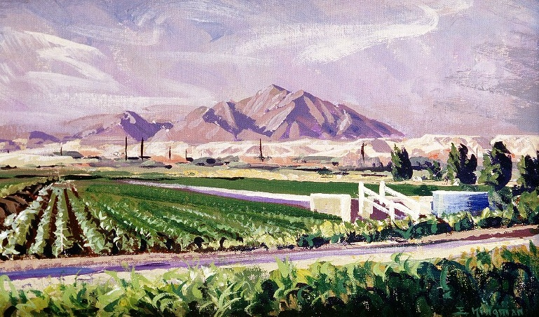

###### {Aerial view of the Gila River running through the Gila River Indian Reservation. Upon closer examination, canals are also visible.}

(Dicklyon, CC BY-SA 4.0 <https://creativecommons.org/licenses/by-sa/4.0>, via Wikimedia Commons)

### The Gila River & Gila River Indian Community (GRIC)

Two Native American Tribes call the Gila River Indian Reservation (GRIR) home: the Pimas (Akimel O’Odham) and the Maricopas (PeePosh). As of 2018, 13,577 people live within the borders of the GRIR, just southwest of Phoenix, with many more members of the community living elsewhere (Gila River Primary Care Area Statistical Profile, 2019). *Akimel O'Odham* means "The River People" (Informational sign on the GRIR).

The Gila River spans the entire width of Arizona and more, traveling from New Mexico across the Arizona border westward until it meets the western Arizona border near Yuma and joins the Colorado River. The Gila River is not just any old river—it is a mighty river that Arizona depends upon. Its watershed covers over more than half of the state, totaling to almost 60,000 square miles, and the river itself totals 570 miles in length in Arizona (Celebrating Arizona’s Rivers). The Gila River could be characterized as the liaison between the Colorado River and the rest of Arizona’s waters; the Gila is the receptacle of nearly all significant Arizonan Rivers, and then transports that water to the Colorado, which then flows into the Gulf of California (Celebrating Arizona’s Rivers).

###### {Visualizing the enormity of the Gila River Watershed, pictured in green}

(Kmusser, CC BY-SA 2.5 <https://creativecommons.org/licenses/by-sa/2.5>, via Wikimedia Commons)

The Gila may sound like a raging river that brings prosper throughout central Arizona from one end of the state to the other, but as someone who has lived in close proximity to the Gila, the expansiveness of the river was shocking information. To me, all rivers in central Arizona are dried up, disappeared. I drive by the Salt River all the time, but that is not a river—only a skeleton of what once was a river. 

Same applies for the Gila. Once an abundant river, it is now showing clear evidence of being severely tampered with over the past century. So much so that most segments of the river do not contain any water at all most of the year. In fact, only 162 of the 570 miles, or about 28 percent, of the Arizonan Gila river flow year-round, a phenomenon that has only recently occurred (Celebrating Arizona’s Rivers). 

And, tragically, the same story arc also applies for the people native to the GRIR. Once a thriving agricultural community, the diversion of their waters for "public" use completely upended their way of life. No longer able to grow their own, nourishing food, the U.S. government sent in unhealthy and unsatisfying canned foods as aid (Gila River Indian Community - History). The GRIC is subject to a massive amount of academic research because, in 2008, the community had the highest rate of diabetes in the world (Brown, 2008). In 2018, the GRIC had a median household income of $18,666, with 48.5% of community members living below the Federal Poverty Line (Gila River Primary Care Area Statistical Profile, 2019).

### Water Battles

The devestating impacts of white settlement in Arizona on the GRIR have been known for over 100 years. Thomsen & Baldys cite Olberg, 1919, relaying that diversion of Gila River water by white settlers began in the 1860s (in alignment with the Homestead Act of 1862) as well as mentioning the huge surge in ground-water pumping in the 1940s. USGS report on south-central Arizona, including the entirety of the GRIR, Thanks to the Arizona Water Settlement Act of 2004, the GRIC once again has rightful ownership of the water on their land. This act came after 117 years of fighting for their water rights. 

<blockquote>
    "It is not stated in the act of Congress how much of this land it is desired to provide water for. It would not be possible with all the water supply of the river to irrigate more than half of it, but of course this would be vastly more than the actual requirements for the sustenance of the Indian, which Mr. Davis estimates to be about an cmre and a half of ground per capital" <i>-CONDITIONS AND COST OF WATER STORAGE FOR IRRIGATION ON THE GILA RIVER, ARIZONA. 56th Congress, 1st session.</i>
</blockquote>

### Water Elsewhere on the GRIR

###### {Firebird Lake on the Gila River Indian Reservation in Chandler, AZ. The boat-racing lake was opened in 1975 to bring jobs into the community.}

(This photograph is in the public domain)

Water takes many other forms on the GRIR, including but not limited to:
* golf course
* casino (running water, etc)
* resort pool
* manmade creek
* spa 
* canals

### Full circle?

All the ammenities on the GRIR, like the incoming soccer stadium for Phoenix's professional soccer team, are very intentional money generators, and not in the traditional, capitalistic sense. Ironically, the motivation of all these new developments is to get to a place where the community has the "infrastructure to return the majority of the Gila River Indian Community to the thriving farmland it once was" (Informational sign on the GRIR). This goal is set to be accomplished by 2030.

###### {Water is pumped in and dyed turquoise to create the artificial creek that winds around the Wild Horse Pass Hotel and Casino interpretive trail}

### The Gila River as Art

###### {Along the Gila Valley by Eugene Kingman. Acrylic. [US Bureau of Reclamation](https://www.usbr.gov/museumproperty/art/ekingman2.html)}

###### {A one-minute film demonstrating the olfactory, visual, and audio experience created by using water from the Gila River in New Mexico} 

<iframe src="https://player.vimeo.com/video/230196025" width="640" height="360" frameborder="0" allow="autoplay; fullscreen; picture-in-picture" allowfullscreen></iframe>

<a href="https://vimeo.com/230196025">Fragrant Mist &amp; Video Projection Tests</a> from <a href="https://vimeo.com/stephendirkes">stephen dirkes</a> on <a href="https://vimeo.com">Vimeo</a>.

### References

Brown, J. J. (2008). When Our Water Returns: Gila River Indian Community and Diabetes1. Evergreen State College: National Science Foundation under Grant.

Bureau of Women’s and Children’s Health, Arizona Department of Health Services. (2019). Gila River Indian Community Primary Care Area (PCA) (pp. 1–4) [Statistical Profile]. Retrieved from https://www.azdhs.gov/documents/prevention/health-systems-development/data-reports-maps/primary-care/pinal/73.pdf

Celebrating Arizona’s Rivers - August 2012: The Gila River. kjzz.org and the University of Arizona Water Resources Research Center. Retrieved from https://media.kjzz.org/s3fs-public/GilaRiverFactSheet.pdf.

Gila River Indian Community. (n.d.-b). History. Retrieved June 7, 2019, from http://www.gilariver.org/index.php/about/history

Multiple signs along the scenic trail near Wild Horse Pass Casino on the Gila River Indian Reservation.

Olberg, C. R., 1919, Report on the San Carlos Irrigation project: Indians of the United States. Hearings before the Committee on Indian Affairs, House of Representatives, 66th Congress, 1st session, v. 2, appendix A., p. 1-1-2.

Thomsen, B. W., and Stanley Baldys. Ground-water conditions in and near the Gila River Indian Reservation, south-central Arizona. No. 85-4073. 1985.

