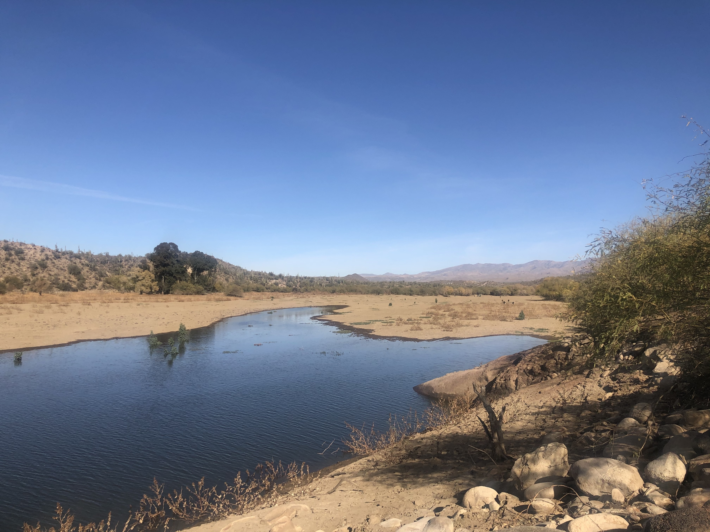

###### {A Central Arizona Project canal transporting water from the Colorado River elsewhere in Arizona}
(This photograph is in the public domain)

### Sources (Present Day)

* 50% of Phoenix water comes from surface and groundwater from the Salt River Project
* About 40% comes from the Colorado River via the Central Arizona Project 
* About 10% is pumped from wells or is recycled wastewater
* 100% of the City of Phoenix's water supply is disinfected using chlorine

The reason Phoenix presently relies on very little groundwater is rooted in the part. Phoenix withdrew excessive amounts of water while it was rapidly growing, that is, until the groundwater crisis was known and a 1980 reform bill shifted the focus to the Central Arizona Project (Powell, 2008).

### Canals

Canals in Phoenix are everywhere. And they kind of always have been. The Hohokam, also known as the Huhugam, (the likely ancestors of the Pima) built an intricate canal system to support their agriculture. 

When manifest destiny brough white settlers to the area, the early days of Phoenix were also characterized by canals, some of which have been preserved for an unbelievable amount of time. The name "Phoenix" originates from those original canals. *Huhugam* means "those who have gone" because of their still unexplained, sudden disappearance. Thus, the Phoenix bird was resemblant of the "rebirth of a city from an ancient and abandoned culture" whose traces left behind were canals (Fast Facts on a sign on the GRIR).

<blockquote>
    “…minerals and algae that collect in the canals that transport our surface water along to Phoenix’s water treatment plants.  The algae is removed during the treatment process, but much like a bouquet of roses that has not been in a room for hours, you still may be able to smell it” (City of Phoenix, FAQ).
</blockquote>

### FAQ: How can I improve the taste and odor of my water?

<blockquote>
    “To improve taste and odor place a slice of lemon in your water” (City of Phoenix, FAQ).
</blockquote>

###### {Me running on the Arizona Canal}

While browsing historic canal photographs, I came across an interesting comment on an article about canals in Phoenix. The poster, Kevin, describes how he ran cross country for Maryvale High School in the 90s and put in many training miles on the Grand Canal. He went on to say that grapefruit trees alongside the canal were the perfect spot for a mid-run snack. This brings back a wave of nostalgia for me, as I have also run hundreds of miles on the canals and have also picked a citrus fruit or two during a run. Then he proposes that Phoenix's canals are being underutilized. He compares them to Venice and San Antonio, wondering why Phoenix didn't follow in their footsteps and place large buildings facing the canals. It's true that all of he canals I've ever run on are outlined by residential streets that are trying the hide from the canal if anything.

### Dams

###### {Terminus of the Agua Fria River, just North of Lake Pleasant and the New Waddell Dam that created the lake. If you look closely, you can see cattle walking in the river bed up ahead.}

<blockquote>
    "My father's reasons for opposing the dam were what we would today call ecological...with his forecasts about the consequences of the dam—most of which, incidentally, have proven correct—was a lone voice in the wilderness."  <i>--Leila Ahmed in her memoir (Ahmed, 1999), daughter of the chairman of the Nile Water Control Board</i>
</blockquote>

### References

Ahmed, Leila. A border passage. Farrar, Straus and Giroux, 1999.

Frequently Asked Questions Drinking Water. City of Phoenix. https://www.phoenix.gov/waterservices/envservices/drinking-water/faqs#:~:text=Drinking%20Water%E2%80%8B,water%20treatment%20and%20distribution%20systems.

Powell, James Lawrence. Dead pool: Lake Powell, global warming, and the future of water in the West. Univ of California Press, 2008.

Where Does Phoenix Water Come From? City of Phoenix. Retrieved from https://www.phoenix.gov/waterservices/resourcesconservation/yourwater. 

